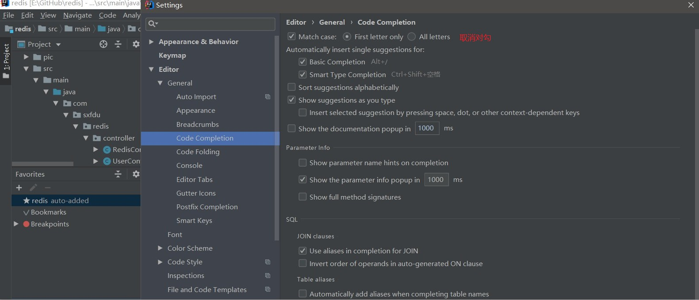
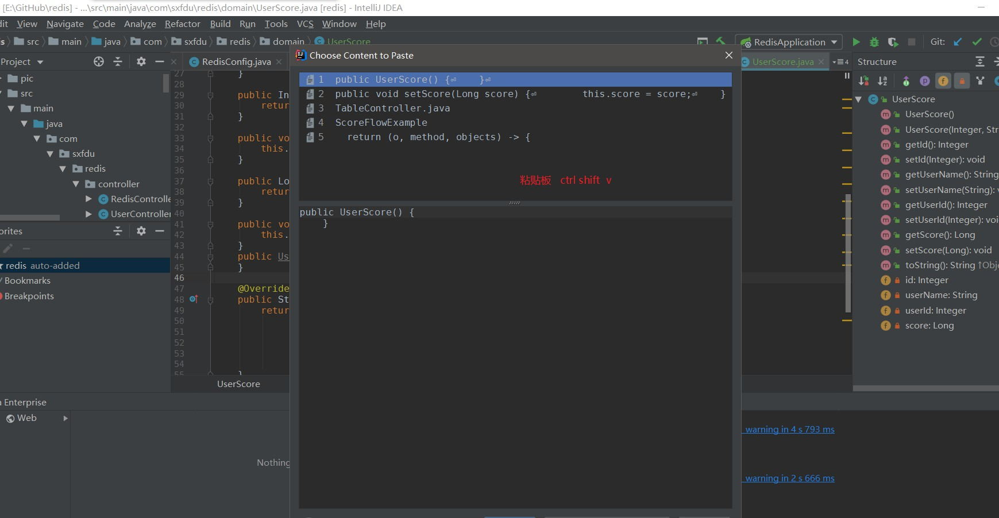
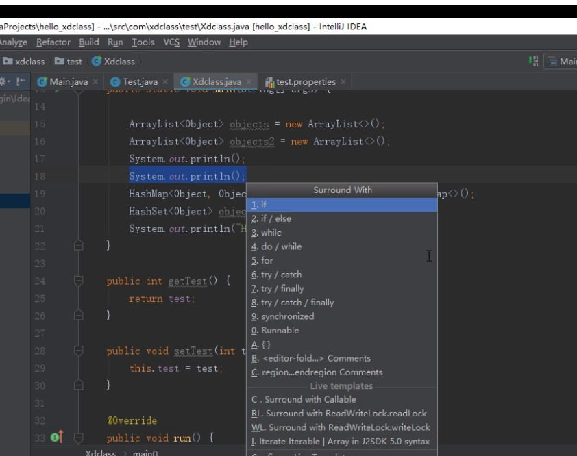
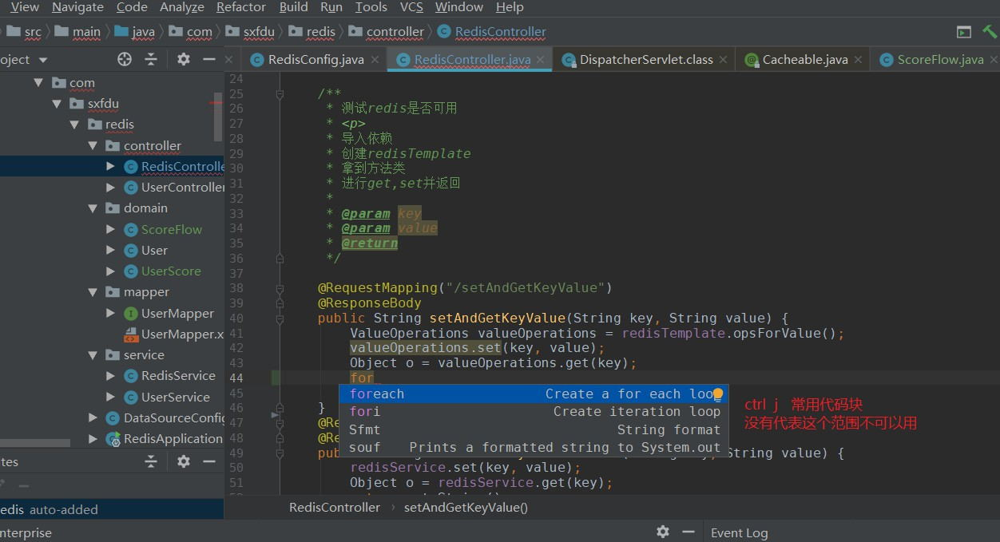
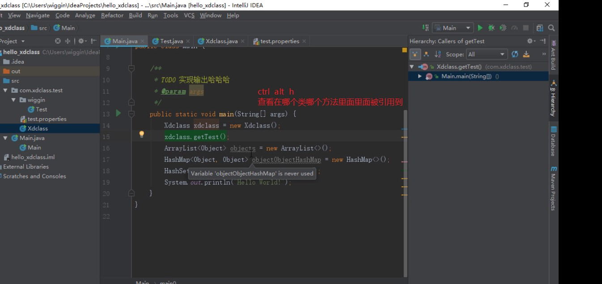
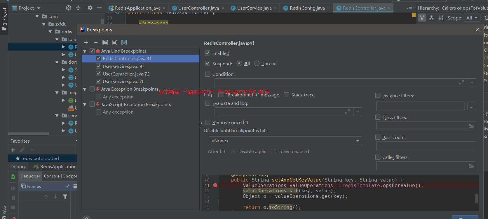

<!-- TOC -->

- [1. IDEA-Maven](#1-IDEA-Maven)
  - [1.1. IDEA](#11-IDEA)
  - [1.2. Maven](#12-Maven)

<!-- /TOC -->

# 1. IDEA-Maven
磨刀不误砍柴工,整理一些拓展知识,基础的网上一大片,就不整理了

## 1.1. IDEA
+ 忽略大小写补全代码:

+ 历史粘贴板

+ ctrl + alt + 上下键  

光标上次出现的位置

+ ctrl + alt + 左右键

代码的来回跳转

+  ctrl + shift / alt + shift   + 上下键  

代码行的上下移动

+ ctrl + alt + t 

选中代码块被 ?  包裹

+ ctrl + j 

常见代码块快速生成

还有一些常见的缩写  
psf(priavte  static final)  
ifn (if (not null))  
sout (system.out.println)

+ ctrl + alt + h

查看代码引用了哪些类,和被哪些类引用 

+ ctrl + alt + m

抽取方法出来(用于重构代码,还有一个重构神器:shift + f6 重命名代码)
+ ctrl + alt + v

自动创建变量,接受返回值

+ 条件断点

在断点上右键

+ 异常断点

## 1.2. Maven